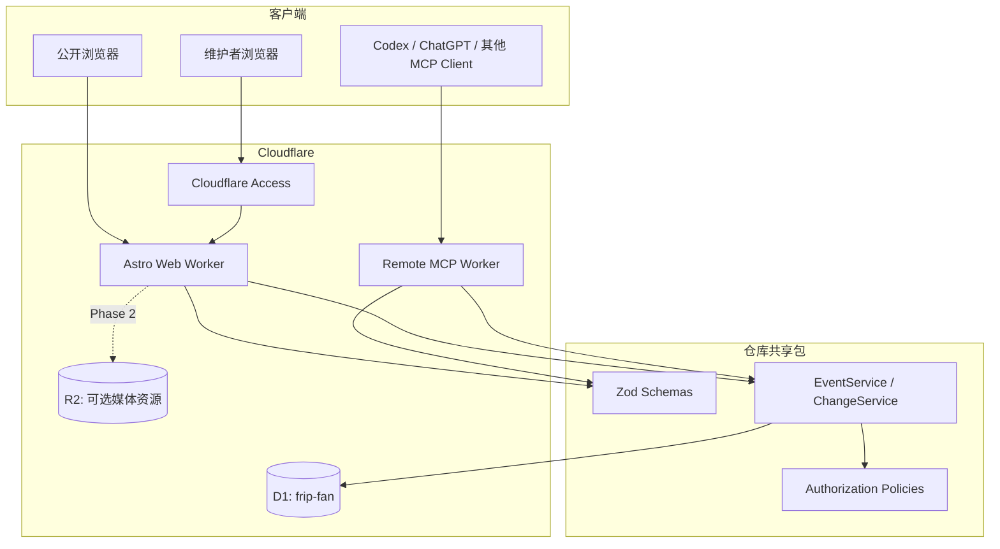
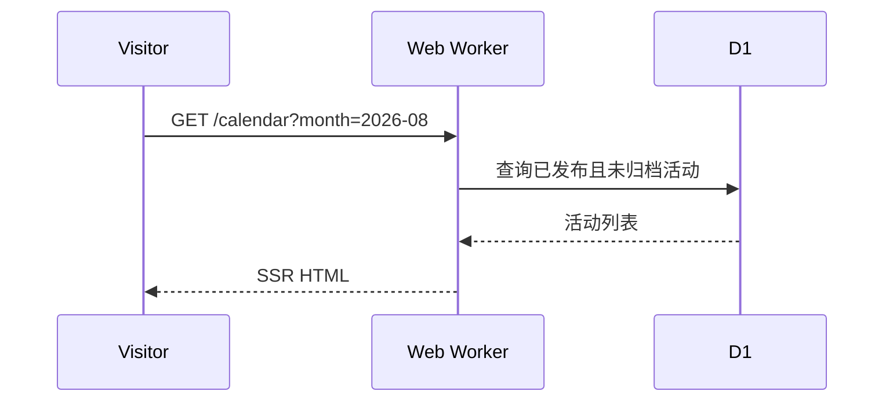
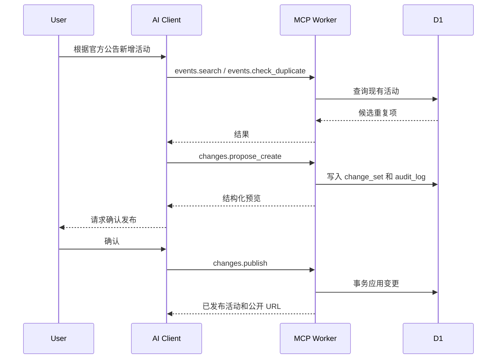

# 总体架构

## 1. 系统目标

系统同时服务三类使用者：

- 访客：浏览近期活动、月历、分类和历史档案。
- 维护者：通过 `/admin` 管理活动，无需编辑代码或数据库。
- AI 助手：通过 Remote MCP 查询、提出变更、预览并在授权后发布。

内容维护必须独立于 Notion、Google Sheets 等外部 CMS。代码仍由 GitHub 管理，内容存储在 D1，代码发布和内容发布互不耦合。

## 2. 组件关系



## 3. 仓库布局

计划采用 npm/pnpm workspace 风格的单仓库：

```text
frip-fan/
├── apps/
│   ├── web/                  # Astro SSR、公开页面、/admin 和 Web API
│   └── mcp/                  # Remote MCP Worker，Streamable HTTP /mcp
├── packages/
│   └── core/                 # Schema、业务服务、权限、共享类型
├── migrations/               # D1 SQL migrations
├── scripts/                  # 导入、导出、数据核验
├── docs/
└── wrangler.*.jsonc          # Web/MCP 的 Cloudflare 配置，或分别置于 app 内
```

`apps/web` 和 `apps/mcp` 不允许各自复制业务规则。所有日期、状态、来源、重复检查、发布和审计规则必须由 `packages/core` 提供。

## 4. Web Worker

### 4.1 公开页面

- `/`：下一场活动、近期活动、分类入口；没有未来活动时展示最近历史记录。
- `/calendar`：桌面月历，移动端默认时间线列表。
- `/calendar.ics`：由公开活动动态生成的完整 iCalendar 订阅源。
- `/archive`：按年份归档。
- `/events/:slug`：活动详情和来源。
- `/about`：制作人员、数据说明、非官方网站声明。

公开查询只能返回：

```sql
published = 1 AND archived_at IS NULL
```

### 4.2 管理页面

- `/admin`：概览和待处理变更。
- `/admin/events`：搜索、过滤和批量检查。
- `/admin/events/new`：人工创建活动。
- `/admin/events/:id`：编辑、预览、发布、取消、归档。
- `/admin/changes`：AI 和人工创建的变更提案。
- `/admin/audit`：审计记录。
- `/admin/data`：CSV 导入、导出和迁移检查。

`/admin/*` 与 `/api/admin/*` 必须由 Cloudflare Access 保护，服务端还要验证 Access JWT，不以“页面不可见”代替 API 鉴权。

## 5. MCP Worker

MCP 部署在独立域名，例如：

```text
https://mcp.example.com/mcp
```

采用当前标准的 Streamable HTTP transport。工具不需要保存对话状态，因此优先使用 Cloudflare `createMcpHandler()` 的无状态模式；只有未来确实需要服务器端会话、elicitation 或持久化 agent state 时才考虑 `McpAgent`/Durable Objects。

MCP Worker 只负责：

1. OAuth 认证和 scope 检查。
2. MCP 协议与工具 schema。
3. 将受控工具调用转交共享业务服务。
4. 返回结构化结果、预览和错误。

它不负责网页渲染，也不暴露数据库、任意 SQL 或任意网络请求能力。

## 6. 数据请求流

### 6.1 公开浏览



第一版不对动态 HTML 和活动 API 做长时间缓存，优先保证发布后立即可见。静态 CSS、JS、字体和图片继续由 Cloudflare 缓存。流量增长后再评估短 TTL 和精确失效。

### 6.2 AI 创建活动



## 7. 关键非功能要求

### 安全

- Admin 与 MCP 分别鉴权。
- 所有 D1 查询使用参数绑定。
- 发布、取消、下线和归档必须记录 audit log。
- MCP Token/OAuth Token 不写入日志或工具结果。
- 对来源 URL 做协议、长度和允许域校验；第一版不让 MCP 服务主动抓取任意 URL。

### 可靠性

- 所有写操作支持幂等键。
- 更新使用乐观锁 `expected_version`。
- 发布 change set 使用 D1 batch/事务语义，避免活动和审计记录部分成功。
- 数据库 migration 与应用部署分开执行。

### 可移植性

- 核心表使用 SQLite/D1 通用类型。
- 禁止将唯一业务逻辑放进 Cloudflare Dashboard。
- migrations、schema、导入导出脚本都进入 Git。
- 随时可以导出 CSV/SQL，在需要时迁往 SQLite 或 PostgreSQL。

## 8. 技术选择

| 领域 | 选择 | 原因 |
|---|---|---|
| Web | Astro SSR | 内容型网站、SEO、低前端 JS、支持 Workers binding |
| UI | Astro + 少量组件 | 避免为日历和后台引入整站 SPA |
| 数据 | Cloudflare D1 | 当前规模足够、SQLite 语义、与 Worker 原生绑定 |
| 校验 | Zod | Web、MCP、导入脚本共用 schema |
| 身份 | Cloudflare Access | 不自行实现密码系统 |
| MCP | Remote MCP / Streamable HTTP | Codex、ChatGPT 和其他 MCP Client 可复用 |
| 媒体 | R2（可选） | 图片需求明确后再启用 |

Astro 的 session API 当前未被使用；配置一个进程内 LRU driver 仅用于阻止 adapter 自动创建未使用的 KV namespace。身份与权限仍完全由 Cloudflare Access JWT 和服务端 scope 校验负责，不能把 LRU session 用作生产登录状态。

## 9. 明确不采用

- Notion 作为在线数据源。
- 浏览器端直接读取 D1 或携带数据库凭据。
- 每次内容修改后重新构建整个网站。
- MCP 通用 `execute_sql`、`fetch_url`、`delete_event` 工具。
- 在第一版实现站内聊天机器人；MCP 由已有 AI Client 调用即可。
